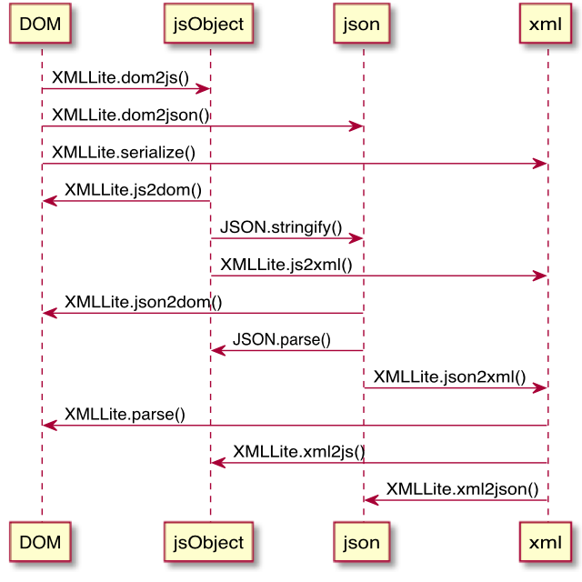

xml
===

[](https://badge.fury.io/js/%40lite-js%2Fxml) [](https://travis-ci.org/lite-js/xml) [](https://coveralls.io/github/lite-js/xml?branch=master)

**Maintaining XML** in pure javascript (IN BOTH NODE.JS & BROWSERS) [Homepage][homepage]

## Maintaining?

### Converting



### Editing/Traversing

```javascript
XMLLite.findChildNode(doc, query);
XMLLite.findChildNodes(doc, query);
XMLLite.findOrCreateChildNode(doc, query);
XMLLite.removeChildNode(doc, query);
XMLLite.eachChildNode(doc, query, callback);
// ...
```

### Formatting

```javascript
XMLLite.beautify(xml, indent);
XMLLite.uglify(xml, preserveComments);
XMLLite.sanitize(xml, reverse);
// ...
```

Actually, you can get the js object from `XMLLite.xml2js(xml)`, do whatever you want, and convert it back to xml again with `XMLLite.js2xml(obj)`.

## Why?

1. A reasonable need for usage in both Node.js and Browsers
2. A more reasonable need to use native APIs(DOMParser/XMLSerializer) to speed up the maintaining process and keep the library thin

## Why `@lite-js/xml`?

1. It **works exactly the same in both Node.js and Browsers**
2. The browser version is supper **light-weight**([dist/xml.js](./dist/xml.js))
3. **Convenient** APIs for converting between xml/js/json/DOM, and lots of helpers to maintain the data structures
4. Super **fast**. it takes less than 30ms to convert an xml document with over 1,000 nodes into a js object

## Install

```shell
$ npm install @lite-js/xml --save
$ npm install @lite-js/xml -g
```

## Usage

In Node.js

```javascript
const XML = require('@lite-js/xml');
```

Command line client

```shell
$ xml-lite --help
```

In browsers

```html
<script src="$path/to/@lite-js/xml/dist/xml.js"> <!-- window.XML is available -->
```

In browsers with webpack

```javascript
import XMLLite from '@lite-js/xml/indexBrowser';
```

## [Demo][homepage]

## [API](./doc/api.md)

## [JSON spec](./doc/json-spec.md)

## [Projects using @lite-js/xml](./doc/projects-using-xml-lite.md)

## [Contributing](./doc/contributing.md)

## [known issues](https://github.com/lite-js/xml/issues)

[homepage]: https://lite-js.github.io/xml/
